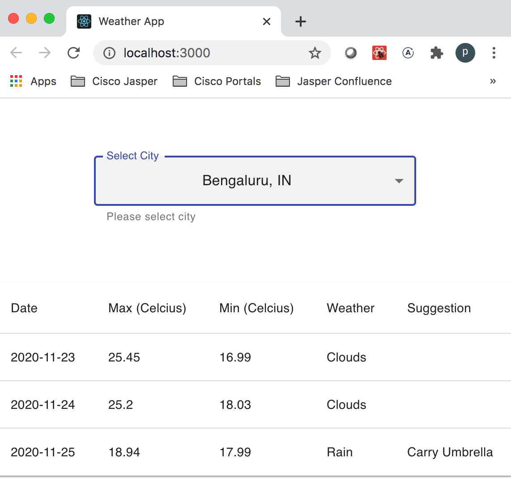

## This is frontend service for auto complete feature

Technology used

1. React JS
2. Typescript

Run below command to generate docker image for frontend service from root folder.

Below command fetches all the packages so it will take 5-10 mins for first time .

```
cd weather-frontend
docker build -t weather-frontend .
```

Above command builts image 'docker.io/library/weather-frontend:latest'

Verify whether image has successfully built by below command:

```
docker images | grep weather-frontend
```

**Note: Before running frontend service, make sure backend service is up and running**

Now to run this service execute below command:

```
docker run -d -p 3000:3000 --name weather-frontend weather-frontend:latest
```

To verify service is working properly execute below url in browser

```
http://localhost:3000
```

You should get below response


